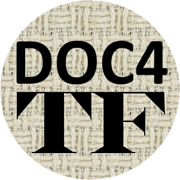

[](https://www.repostatus.org/#active) [](https://doi.org/10.5281/zenodo.12705876)  [](https://tonyjurg.github.io/Doc4TF/) [](https://archive.softwareheritage.org/browse/origin/https://github.com/tonyjurg/Doc4TF) [](https://creativecommons.org/licenses/by/4.0/)



# Why Doc4TF?

Ideally, comprehensive end-user documentation should accompany the development of a Text-Fabric dataset. However, this task isn't always completed in the initial phase. Furthermore, changes to features often go unrecorded in the documentation, leading to mismatches between the actual data and its supposed description.

This [Jupyter Notebook](https://github.com/tonyjurg/Doc4TF/blob/main/CreateFeatureDoc.ipynb) contains Python code to automatically generate a documentation set for any Text-Fabric dataset based on *its actual data*. It serves as a robust starting point for developing a brand-new documentation set, especially since the resulting documentation is fully hyperlinked, a task that can be laborious if done manually. The tool can also be used to validate existing documentation.

# Using Doc4TF 

Since Doc4TF is implemented as a Jupyter Notebook, you will need an environment capable of running Jupyter Notebooks.  Given that this tool is designed for use with Text-Fabric, you likely already have a suitable environment set up. If not, a good option is to install [Anaconda](https://www.anaconda.com/).

To start using Doc4TF, you first need to download this [Jupyter Notebook file](https://github.com/tonyjurg/Doc4TF/blob/main/CreateFeatureDoc.ipynb) and place it anywhere on your system where you can execute it. The notebook will guide you through the process, which basically consists of the following steps::
* Load the Text-Fabric database you specify.
* Execute the code pressent in the subsequent cells. The code will:
   * Construct a python dictionary with relevant data from the TF datase.
   * Create separate files for each feature.
   * Create index pages.

The tool outputs a set of markdown files (extention '.md'), the standard format for Text-Fabric feature documentation. To view these files in a standard web browser, post-processing, specifically rendering the markdown into HTML, is required. One method is to upload the files to a GitHub repository, enabling viewing the markdown files in any browser. Alternatively, you can installing an extension like [markdown viewer](https://github.com/simov/markdown-viewer) which would allow you to  view the rendered markdown files directly in your browser. 

Alternatively, the script can also generate a set of HTML files. These files can be stored on a local drive which allows for browsing them using any webbrowser.

An example documentation set created by this script is found at the [results directory](https://github.com/tonyjurg/Doc4TF/blob/main/results/featurebynodetype.md). 

# Determining the delta between two TF datasets

An additional tool has been created to identify changes between two Text-Fabric datasets, including differences in features, feature values, node types, and ranges. The tool is available as a Jupyter Notebook: [determineDeltaBetweenVersions.ipynb](tools/determineDeltaBetweenVersions.ipynb). It generates a dynamic report that allows for in-depth exploration and can be downloaded as an HTML file. This report can be used to quickly identify necessary documentation updates. It also facilitates regression testing of code updates to detect any adverse effects.

# About Text-Fabric

Text-Fabric is a powerful Python library and framework designed to facilitate the analysis and manipulation of large-scale textual data, particularly in the context of ancient languages and biblical texts. It provides a comprehensive set of tools for processing and querying structured text data efficiently. Text-Fabric was developed by [Dirk Roorda](https://github.com/dirkroorda). The software package is accessible at [https://github.com/annotation/text-fabric](https://github.com/annotation/text-fabric).

# BibTeX Citation

```bibtex
@software{Jurg_Doc4TF_2024,
author = {Jurg, Tony},
doi = {10.5281/zenodo.12705876},
month = jul,
title = {{Doc4TF}},
url = {https://github.com/tonyjurg/Doc4TF},
version = {0.5.2},
year = {2024}
}
```
