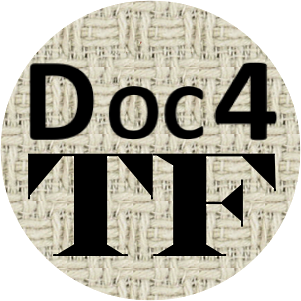

 

# Why Doc4TF?

Ideally, a comprehensive documentation set should be created as part of developing a Text-Fabric dataset. However, in practice, this is not always completed during the initial phase or after changes to features. This [Jupyter Notebook](https://github.com/tonyjurg/Doc4TF/blob/main/CreateFeatureDoc.ipynb) contains Python code to automatically generate (and thus ensure consistency) a documentation set for any Text-Fabric dataset. It serves as a robust starting point for the development of a brand new documentation set or as validation for an existing one. One major advantage is that the resulting documentation set is fully hyperlinked, a task that can be laborious if done manually. 

# Using Doc4TF 

Since Doc4TF is implemented as a Jupyter notebook, you will need an environment capable of running Jupyter notebooks. As this tool is intended to be used alongside Text-Fabric, it's likely that you have already set up such an environment. If you haven't done so yet, a good option is to install [Anaconda](https://www.anaconda.com/).

To start using Doc4TF, you first need to download this [Jupyter Notebook file](https://github.com/tonyjurg/Doc4TF/blob/main/CreateFeatureDoc.ipynb) and place it anywhere on your system where you can execute it. The notebook will guide you through the process, which basically consists of the following steps::
* Load the Text-Fabric database you specify.
* Execute the code pressent in the subsequent cells. The code will:
   * Construct a python dictionary with relevant data from the TF datase.
   * Create separate files for each feature.
   * Create index pages.

The output of the tool consists of a set of markdown which is the standard file format used for regular Text-Fabric feature documentation. To browse these files using a standard web browser, they need to undergo post-processing. One method is to transfer the files to a GitHub repository, which allows any browser to view the post-processed files. It is also possible to browse markdown files directly in your browser after installing a browser extension like [markdown viewer](https://github.com/simov/markdown-viewer). The script can also create a set of HTML files that can be stored on a local drive and browsed using any webbrowser.

An example documentation set created by this script is found at the [results directory](https://github.com/tonyjurg/Doc4TF/blob/main/results/featurebynodetype.md). 

# About Text-Fabric

Text-Fabric is a powerful Python library and framework designed to facilitate the analysis and manipulation of large-scale textual data, particularly in the context of ancient languages and biblical texts. It provides a comprehensive set of tools for processing and querying structured text data efficiently. Text-Fabric was developed by [Dirk Roorda](https://github.com/dirkroorda). The software package is accessible at [https://github.com/annotation/text-fabric](https://github.com/annotation/text-fabric).
