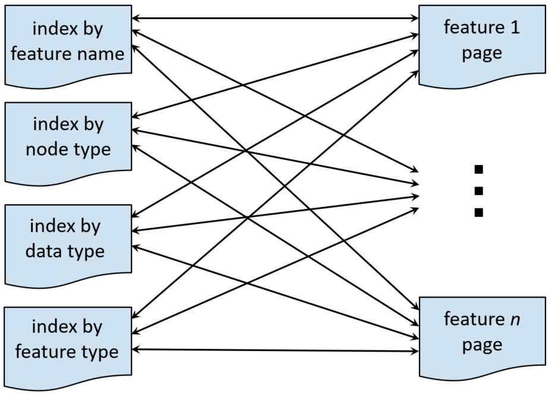

## About Doc4TF

Ideally, a comprehensive documentation set should be created as part of developing a Text-Fabric dataset. However, in practice, this is not always completed during the initial phase or properly updated after changes are made to features. This [Jupyter Notebook](https://github.com/tonyjurg/Doc4TF/blob/main/CreateFeatureDoc.ipynb) contains Python code to automatically generate a documentation set for any Text-Fabric dataset based upon *its actual data*. Two types of information are extracted from the dataset and presented on various pages. These include:

  * Structural details regarding nodes (e.g., their names) and features (e.g., name, data type, feature type, and value frequencies)
  * Descriptive details regarding features. The extent and correctnes of these descriptions depend - for obvious reasons- upon the embedded meta data.

The pages produced by Doc4TF can serve as a robust starting point for the development of a brand new documentation set or as validation for an existing one. One major advantage is that the resulting documentation set is fully hyperlinked, a task that can be laborious if done manually. The following image shows the relation between the overview and the feature description pages.

A fully functioning example documentation set generated by Doc4TC can be viewed [here](https://github.com/tonyjurg/Doc4TF/blob/main/results/featuresbynodetype.md).

